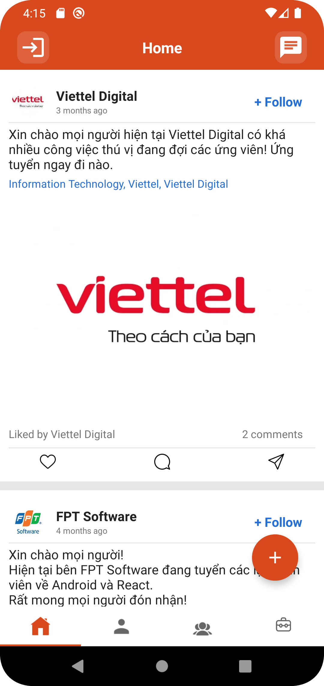

# JobSharing

<pre>
          
       
</pre>

##

 
 

 
# Firebase implementation:

    implementation platform('com.google.firebase:firebase-bom:31.0.2')
    implementation 'com.google.firebase:firebase-database'
    implementation 'com.google.firebase:firebase-auth:'
    implementation 'com.google.firebase:firebase-storage:20.1.0'
    implementation 'com.google.firebase:firebase-messaging:23.0.5' // add firebase messaging
    implementation 'com.firebaseui:firebase-ui-database:8.0.2''
 
 # Another implementation:
 
    // Rounded ImageView
    implementation 'com.makeramen:roundedimageview:2.3.0'
    implementation "androidx.recyclerview:recyclerview:1.2.1"

    //Retrofit
    implementation 'com.squareup.retrofit2:retrofit:2.9.0'
    implementation 'com.squareup.retrofit2:converter-scalars:2.9.0'

    //Universal image loader Module
    implementation 'com.nostra13.universalimageloader:universal-image-loader:1.9.5'
    implementation 'com.github.bumptech.glide:glide:4.12.0'

 

# 💫About Me :

I'm a android developer from Vietnam.

- 🔭 I’m currently studying at [Vietnam Academy of Cryptography Techniques](https://actvn.edu.vn/)

- 🌱 I’m currently learning **Android(Java)**

- 💬 Ask me about **android, mobile,..**

- 📫 How to reach me **huuthom0209@gmail.com**

# 🌐Socials
    

### ✍️Random Dev Quote

---

